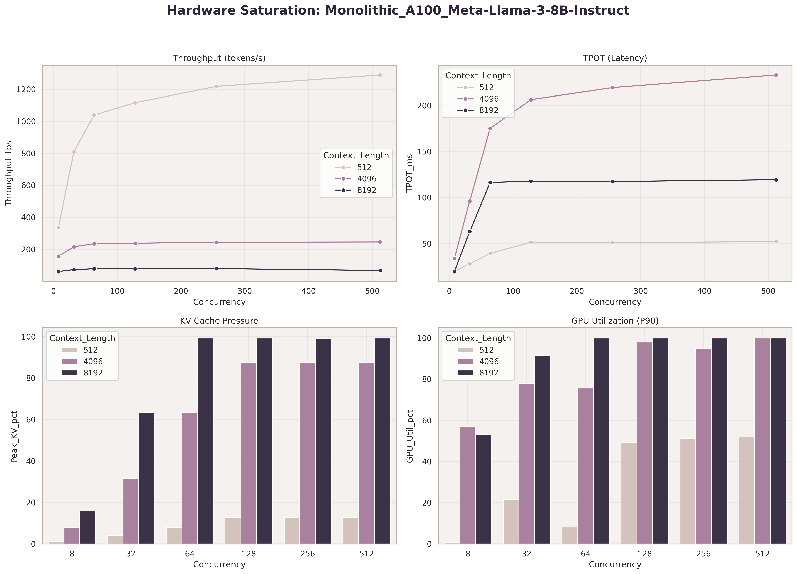
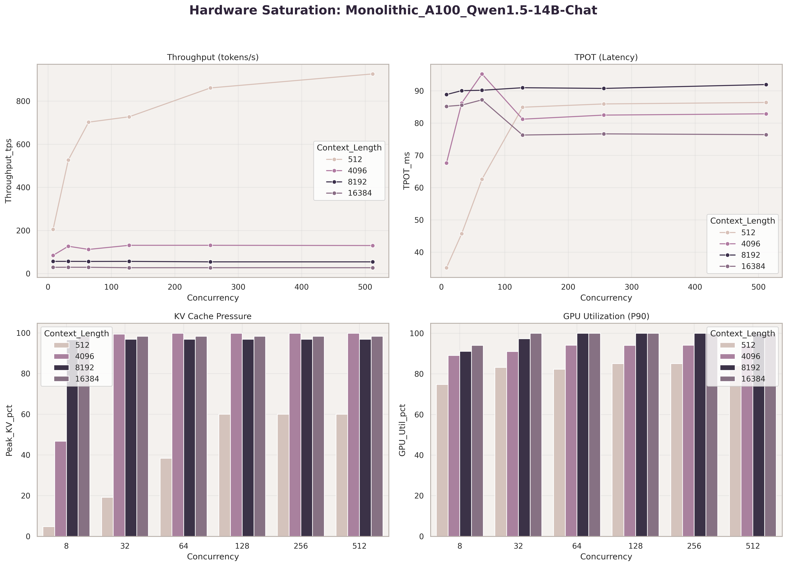

# DIP v2: Disaggregated Inference Platform

**Building on NVIDIA Dynamo’s prefill–decode disaggregation model, DIP characterizes bottlenecks in KV-cache orchestration and heterogeneous hardware topologies, focusing on their impact on latency and throughput.**

Different AI workloads have distinct hardware requirements aligned with their serving characteristics. Model performance optimization co-designs model execution and serving infrastructure around production constraints such as tail-latency targets (p95/p99), concurrency profiles, request burstiness, sequence length distributions, and hardware limits, while maintaining predictable, cost-efficient inference at scale.

This project studies model serving performance under heterogeneous system constraints, focusing on how architecture and data movement strategies impact inference performance.

# Key Findings

### 1. Prefix caching eliminates redundant prefill cost and dominates long-context serving performance

- At 8192-token prompts and 128 concurrent requests, vLLM recomputes the full prompt for every request.
- SGLang's RadixAttention caches the prompt KV state after the first request and reuses it across all subsequent requests sharing the same prefix, eliminating prefill cost for cache hits.
- Under this workload, where all concurrent requests share an identical prompt, this produced a ~1,676× throughput difference representing the upper bound of prefix caching advantage. (vLLM: 0.85 tok/s, 73s TTFT, 137s P95; SGLang: 1,426 tok/s, 2.0s TTFT, 8.3s P95)

  
### 2. Moving KV cache can become as expensive as generating tokens
In phase-disaggregated inference, the system eventually spends as much time transferring KV cache between GPUs as it spends generating new tokens.
At 2048-token context and concurrency 8:
- Token generation: ~515 ms/token
- KV transfer: ~511–566 ms

Once transfer time matches compute time, compute-side optimizations alone provide diminishing returns without a corresponding improvement in the interconnect layer.

### 3. Long prompts exhaust GPU memory faster than additional users
Increasing concurrency improves throughput only up to a point. Long contexts are a much stronger scaling constraint because they rapidly consume KV-cache memory.
On a single A100:
- Throughput remained healthy at 512-token contexts
- Performance degraded sharply at 4096 tokens
- At 8192 tokens, throughput collapsed to <1 tok/s

This indicates that KV-cache capacity, rather than concurrency, becomes the dominant bottleneck for long-context serving.

### 4. Model size accelerates KV cache exhaustion more than concurrency

- At 4096-token context on a single A100, Qwen 1.5-14B saturates KV cache at concurrency 32 while Llama 3-8B doesn't saturate until concurrency 128, a 4× difference in effective serving headroom driven entirely by model size.
- Beyond that threshold, throughput becomes insensitive to additional requests for both models, confirming KV cache capacity as the binding constraint at scale.

## Evaluated Architectures
 
- **Monolithic (Coupled) Inference:** Distributed A100 and H100 clusters
- **Inference Engine Comparison:**  vLLM vs SGLang vs TensorRT-LLM (isolated on monolithic A100/H100 to separate software gains from topology effects)
- **Phase-Disaggregated Inference:** KV-cache transfer benchmarks on A100 and H100 clusters
- **Role-Based Disaggregated Inference:** Control-plane / data-plane separation with admission control and circuit breaking
  
# 1. Inference Engine Comparison 
### 1. vLLM vs SGLang (A100, Llama-3-8B-Instruct)
*Monolithic A100, same hardware and model. Engine is the only variable.*

| Engine | Context | Concurrency | TTFT (ms) | TPOT (ms/tok) | Throughput (tok/s) | P95 (ms) |
|---|---|---|---|---|---|---|
| vLLM | 512 | 8 | 501 | 17.9 | 345 | 502 |
| SGLang | 512 | 8 | 83 | 19.7 | 394 | 83 |
| vLLM | 512 | 128 | 4004 | 58.9 | 902 | 10640 |
| SGLang | 512 | 128 | 298 | 29.8 | 2172 | 4211 |
| vLLM | 4096 | 8 | 2444 | 38.1 | 124 | 3672 |
| SGLang | 4096 | 8 | 131 | 20.9 | 367 | 157 |
| vLLM | 4096 | 128 | 32134 | 262 | 159 | 66509 |
| SGLang | 4096 | 128 | 1081 | 32.1 | 1989 | 5363 |
| vLLM | 8192 | 8 | 4505 | 0 | 0.75 | 7587 |
| SGLang | 8192 | 8 | 219 | 20.3 | 365 | 268 |
| vLLM | 8192 | 128 | 73174 | 0 | 0.85 | 136792 |
| SGLang | 8192 | 128 | 2039 | 45.1 | 1426 | 8259 |

**Analysis**

- At short contexts (512 tokens), both engines deliver comparable single-request performance, but SGLang achieves substantially lower TTFT and higher aggregate throughput as concurrency increases.

- The performance gap widens dramatically as context length grows. At 4096-token prompts and concurrency 128, SGLang delivers 1989 tok/s versus 159 tok/s for vLLM while reducing TTFT from 32.1 s to 1.1 s.

- The largest performance gap appears **at 8192-token context and concurrency 128. vLLM throughput collapses to 0.85 tok/s with 73 s TTFT and 137 s P95 latency, while SGLang maintains 1426 tok/s with 2.0 s TTFT and 8.3 s P95 latency, a ~1676× throughput advantage under maximum cache reuse conditions on identical hardware.**

- The results suggest vLLM becomes KV-memory constrained at long contexts, with KV-cache utilization approaching saturation (~99%) between 4096 and 8192 tokens. SGLang maintains high throughput under the same workload, indicating significantly more efficient long-context serving on identical hardware.

**Note:** SGLang's gains are maximized here because all concurrent requests share an identical prompt, representing near-100% cache hit rate. Production gains will vary based on system prompt reuse patterns across requests.

# 2. Monolithic (Coupled) Inference

**Table 1: Monolithic (A100) — Llama-3-8B-Instruct**
- *Llama-3-8B transitions from compute-efficient to KV-memory-bound as context length increases, with throughput collapsing once KV utilization approaches saturation.*

| Context | Concurrency | TTFT (ms) | TPOT (ms/tok) | Throughput (tok/s) | P95 (ms) | KV Util (%) |
|---|---|---|---|---|---|---|
| 512 | 8 | 501 | 17.9 | 345 | 502 | 1.44 |
| 512 | 128 | 4004 | 58.9 | 902 | 10640 | 17.72 |
| 512 | 512 | 22527 | 58.9 | 969 | 41968 | 18.05 |
| 4096 | 8 | 2444 | 38.1 | 124 | 3672 | 9.79 |
| 4096 | 64 | 16108 | 231 | 158 | 29088 | 78.51 |
| 4096 | 128 | 32134 | 262 | 159 | 66509 | 99.64 |
| 8192 | 8 | 4505 | 0 | 0.75 | 7587 | 19.39 |
| 8192 | 64 | 33371 | 0 | 0.84 | 68795 | 99.49 |

- At 512 context, throughput scales from 345 to 969 tok/s with concurrency, while TPOT rises gradually and KV utilization remains below 18%, indicating the system is compute- and batching-efficient with significant memory headroom.

- At 4096 context, throughput saturates at ~158 tok/s by concurrency 64 and KV utilization reaches 99.64% by concurrency 128. Beyond this point, additional concurrency no longer improves throughput, indicating a transition into a KV-memory–bound state.

- At 8192 context, throughput collapses to <1 tok/s and becomes effectively insensitive to additional concurrency. KV-cache capacity emerges as the dominant bottleneck.
  
### Hardware Saturation Sweep 

**Throughput (top left):** 
- At 512 tokens, throughput scales continuously to ~1300 tok/s through concurrency 512, the A100 is not saturated at short contexts and keeps absorbing load.
- At 4096, throughput plateaus around 240 tok/s by concurrency 64 and stops scaling entirely.
- At 8192, throughput collapses to ~100 tok/s from the first sweep, suggesting the workload reaches KV-cache limits almost immediately, leaving little opportunity for batching gains.

**TPOT (top right):** 
- The 4096 curve spikes to ~230ms by concurrency 64 and then stabilizes, marking a clear transition into a memory-bound state.
- The 512 curve remains below 60ms throughout.
- At 8192, latency stabilizes immediately at ~120ms, indicating the workload is increasingly memory-bound rather than compute-bound.

**KV Cache (bottom left):** 
- At 8192, KV cache hits 100% by concurrency 64 and stays pinned for the entire sweep.
- At 4096 it saturates by concurrency 128.
- At 512 it never exceeds ~18%, confirming significant unused VRAM headroom at short contexts, the GPU has memory to spare but no batching pressure to fill it.

**GPU Utilization (bottom right):** 
- Utilization climbs with both context length and concurrency, reaching 95%+ at 8192 by concurrency 128.
- Counterintuitively, the highest utilization occurs at long contexts despite lower throughput — the GPU is not idle, it is stalled on KV cache memory reads rather than doing useful compute.
- At 512 context utilization stays around 50% even at concurrency 512.

**Table 2: Monolithic (A100) — Qwen1.5-14B-Chat**
- *Qwen-14B reaches memory pressure much earlier than Llama-3-8B, causing throughput to plateau at relatively low concurrency and long contexts.*
  
| Context | Concurrency | TTFT (ms) | TPOT (ms/tok) | Throughput (tok/s) | P95 (ms) | KV Util (%) |
|---|---|---|---|---|---|---|
| 512 | 8 | 474 | 35.2 | 205 | 475 | 4.80 |
| 512 | 128 | 3909 | 84.9 | 727 | 17235 | 60.02 |
| 512 | 512 | 34866 | 86.4 | 926 | 61511 | 60.02 |
| 4096 | 8 | 3224 | 67.6 | 84 | 5096 | 46.76 |
| 4096 | 32 | 8951 | 86.2 | 126 | 24985 | 99.37 |
| 8192 | 8 | 6585 | 88.8 | 56 | 10007 | 96.66 |
| 16384 | 8 | 15305 | 85.2 | 29 | 26992 | 98.33 |
| 16384 | 128 | 140082 | 76.3 | 27 | 267948 | 98.33 |

- At 512 context, throughput scales up to 926 tok/s, while KV utilization remains below saturation even at high concurrency, indicating residual batching capacity despite higher per-token memory cost.

- At 4096 context, KV cache saturates at ~99% by concurrency 32, significantly earlier than Llama-3-8B, reflecting higher memory pressure from larger attention heads. Throughput becomes insensitive to additional concurrency, indicating early transition into a memory-bound state.

- At 8192 and 16384 context, throughput stabilizes at ~27–29 tok/s regardless of concurrency, indicating full saturation of both KV capacity and memory bandwidth. At this scale, a single A100 is structurally insufficient for meaningful throughput, requiring either tensor parallelism or multi-GPU offloading.

### Hardware Saturation Sweep 

**Throughput (top left):** 
- At 512 tokens, throughput scales to ~920 tok/s by concurrency 512 — lower ceiling than Llama 8B, reflecting the larger model's memory bandwidth cost per forward pass.
- At 4096 it plateaus around 130 tok/s from concurrency 64.
- At 8192 and 16384 throughput is effectively flat from the first sweep at ~50 tok/s and ~30 tok/s respectively — the model leaves so little VRAM headroom that batching never gets off the ground at long contexts.

**TPOT (top right):** 
- All context lengths converge to a narrow 75–92ms band almost immediately, with minimal degradation as concurrency scales to 512.
- This is a distinct pattern from Llama — rather than a sharp spike and plateau, Qwen hits its memory bandwidth ceiling at very low concurrency and stays there.
- The system is saturated from the first sweep across all context lengths above 512.

**KV Cache (bottom left):** 
- KV cache pressure is near 95–100% from concurrency 8 across all context lengths beyond 512.
- At 512 context it reaches 60% by concurrency 128 — still substantially higher than Llama 8B at the same load, reflecting the larger model's reduced VRAM headroom.
- The 16384 context curve pins at 98% from the very first sweep.

**GPU Utilization (bottom right):** 
- GPU utilization stays above 80% across all sweeps and all context lengths, including at concurrency 8.
- Unlike Llama 8B where utilization climbs with load, Qwen 14B keeps GPU utilization above 80% even at low concurrency, indicating substantially higher baseline hardware pressure than Llama-3-8B.
- The larger model leaves less headroom for batching and reaches resource limits much earlier than the 8B model.

# 3. Phase-Disaggregated Inference
### 1. KV-cache transfer between prefill and decode stages (A100 clusters, NVLink-connected GPU pairs with CUDA peer-to-peer communication)

#### Llama-3-8B-Instruct

| Context | Concurrency | Throughput (tok/s) | TPOT (ms/tok) | IPC Transfer (ms) |
| :--- | :--- | :--- | :--- | :--- |
| **128** | 1 | 10.73 | 93.21 | 10.26 |
| **128** | 2 | 19.66 | 101.50 | 8.58 |
| **128** | 4 | 23.52 | 169.60 | 17.75 |
| **128** | 8 | 21.90 | 364.15 | 58.34 |
| **512** | 1 | 11.32 | 88.35 | 21.22 |
| **512** | 4 | 22.01 | 181.39 | 43.24 |
| **512** | 8 | 20.13 | 396.49 | 162.89 |
| **1024** | 1 | 10.60 | 94.33 | 34.56 |
| **1024** | 8 | 18.74 | 425.67 | 307.18 |
| **2048** | 1 | 9.38 | 106.65 | 65.41 |
| **2048** | 8 | 15.50 | 515.18 | 511.27 |

#### Qwen1.5-14B-Chat

| Context | Concurrency | Throughput (tok/s) | TPOT (ms/tok) | IPC Transfer (ms) |
| :--- | :--- | :--- | :--- | :--- |
| **128** | 1 | 10.73 | 93.23 | 11.16 |
| **128** | 2 | 21.48 | 93.10 | 6.29 |
| **128** | 4 | 24.42 | 163.66 | 18.57 |
| **128** | 8 | 21.83 | 365.43 | 45.70 |
| **512** | 1 | 11.71 | 85.40 | 18.33 |
| **512** | 4 | 22.65 | 175.87 | 51.33 |
| **512** | 8 | 20.34 | 392.74 | 114.99 |
| **1024** | 1 | 10.85 | 92.19 | 34.90 |
| **1024** | 8 | 18.31 | 435.79 | 342.50 |
| **2048** | 1 | 9.25 | 108.09 | 68.67 |
| **2048** | 8 | 15.65 | 510.40 | 565.55 |

- Throughput is largely flat across both models and context lengths, increasing concurrency does not improve output rate, suggesting that inter-stage KV transfer is the dominant bottleneck.
- TPOT increases sharply with concurrency for both models, rising from ~93ms to ~510ms, suggesting that the transfer layer becomes saturated under higher concurrency, largely independent of model size.
- At 2048 context and concurrency 8, IPC transfer time becomes comparable to TPOT (511ms vs 515ms for Llama, 565ms vs 510ms for Qwen), indicating that KV movement cost is approaching the cost of token generation.
-  At this point, system performance becomes increasingly constrained by interconnect overhead, and further compute-side optimization yields diminishing returns unless the transfer layer is improved.

# 4. Role-Based Disaggregated Inference
Admission-controlled routing with circuit breaking separates request intake from GPU execution, enforcing backpressure via semaphore and GPU admission gates to shed load under burst concurrency, trading raw acceptance rate for bounded tail latency and predictable execution time.

| Total Requests | Successful (200) | Rejected (503) | Throughput (req/s) |
|---------------:|-----------------:|---------------:|-------------------:|
| 150            | 65               | 85              | 44.7              |

Bursty high-concurrency inference workloads can cause GPU queues to grow unbounded, resulting in severe TTFT inflation, tail-latency amplification (P95), and starvation of long-running requests. 

The hybrid role-based architecture mitigates this by enforcing admission control and circuit breaking, converting overload into early rejection rather than allowing cascading latency collapse. 

This design prioritizes predictable latency and bounded GPU execution over unrestricted throughput, enabling stable serving behavior under sustained overload conditions.

## Appendix: DIP v1 — Role-Based Disaggregation (Ngrok / T4 Prototype)
 
Initial experiments using a public tunneling layer (Ngrok) to route inference to a T4 edge worker revealed batching inefficiencies under network jitter. Despite sustained request pressure, the worker GPU reached only ~40% SM utilization, while the A100 orchestrator was largely idle — a network-induced batching breakdown (drip-feed effect) where jitter prevents stable decode/prefill aggregation.

Under identical workloads, the monolithic A100 achieved 477 tok/s at 123 ms TTFT, whereas the disaggregated topology collapsed to 32 tok/s at 1008 ms — a ~15× throughput drop driven by network overhead and the drip-feed effect rather than raw compute capacity, as evidenced by the T4's 40% SM utilization.
 
| Architecture Role | Hardware | Test Batch Size | VRAM Allocation | SM Compute Peak | Primary Bottleneck |
| :--- | :--- | :--- | :--- | :--- | :--- |
| Disaggregated Worker | T4 | 10 | 95% (14.2/15GB) | 40.0% | Host/network-bound (batching disrupted by network jitter) |
| Disaggregated Router | A100 | 10 | 0% (0/80GB) | 0.0% | Network-bound coordination (idle while awaiting worker responses) |
 
This result motivated a redesign toward strict control-plane / data-plane separation, introducing explicit admission control and GPU backpressure handling in DIP v2.
